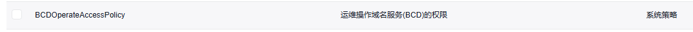

# certbot-dns-baidu-docker

使用百度云DNS的certbot插件, 打包为docker

本项目只是将[certbot-dns-baidu](https://github.com/Asterisci/certbot-dns-baidu)打包到docker中，方便使用。

部分sh来自[certbot-dns-aliyun](https://github.com/justjavac/certbot-dns-aliyun)。

## 两个文件夹区别

certbot-dns-baidu更类似于官方发布docker镜像模式，例如[certbot/dns-cloudflare](https://hub.docker.com/r/certbot/dns-cloudflare)
，仅负责生成和续期功能，自动续期需要自己设置定时任务

certbot-dns-baidu-auto相比certbot-dns-baidu就只是多了每天检查证书过期时间，然后自动续期

## 安装

<del>使用 docker pull</del>

由于还未测试自动续期是否可正常使用,确认可用后再上传docker hub

````bash
# 任选其一
docker pull certbot-dns-baidu

docker pull certbot-dns-baidu-auto
````

或 自己生成Docker镜像

````shell
# 任选其一
cd centbot-dns-baidu
docker build -t certbot-dns-baidu .

cd centbot-dns-baidu-auto
docker build -t certbot-dns-baidu-auto .
````

## 百度云权限

具体方法我就不写了，一搜一大把，设置DNS需要有这个权限



## 配置文件 `credentials.ini`

填入从百度云那里取得的key

```ini
dns_baidu_access_key = 12345678
dns_baidu_secret_key = 1234567890abcdef1234567890abcdef
```

需要将ini文件权限设置为600

```bash
chmod 600 credentials.ini
```

## certbot-dns-baidu

### 申请证书

````bash
docker run -it --rm --name certbot-dns-baidu \
            -v "/etc/letsencrypt:/etc/letsencrypt" \
            -v "/var/lib/letsencrypt:/var/lib/letsencrypt" \
            certbot-dns-baidu certonly \
            # --dry-run \
            # 指定配置文件位置
            --dns-baidu-credentials /var/lib/letsencrypt/credentials.ini \
            # 验证DNS前等待秒数(可选,默认120)
            --dns-baidu-propagation-seconds 120 \
            -d example.com \
            -d "*.example.com"
````

### 续期证书

````bash
docker run -it --rm --name certbot-dns-baidu \
            # 证书存储位置
            -v "/etc/letsencrypt:/etc/letsencrypt" \
            # 配置文件存放目录,部分日志也会输出到这里
            -v "/var/lib/letsencrypt:/var/lib/letsencrypt" \
            certbot-dns-baidu renew \
            # --dry-run \
            # 指定配置文件位置
            --dns-baidu-credentials /var/lib/letsencrypt/credentials.ini \
            # 验证DNS前等待秒数(可选,默认120)
            --dns-baidu-propagation-seconds 120 \
            --email 'your@email.com'
````

## certbot-dns-baidu-auto

### 工作流程

#### 新创建

启动容器->添加要申请的域名

#### 重新创建

启动容器即可

### 运行容器

````bash
docker run -it -d --name certbot-dns-baidu-auto \
            # 证书存储位置
            -v "/etc/letsencrypt:/etc/letsencrypt" \
            # 配置文件存放目录,部分日志也会输出到这里
            -v "/var/lib/letsencrypt:/var/lib/letsencrypt" \
            # 配置文件位置(可选,默认/var/lib/letsencrypt/credentials.ini)
            -e CONF_PATH="/var/lib/letsencrypt/credentials.ini" \
            # 验证DNS前等待秒数(可选,默认120)
            -e PROPAGATION_SECONDS=120 \
            # 证书刷新通知邮箱
            -e EMAIL="your@email.com" \
            # 容器自动启动
            --restart=always
            certbot-dns-baidu-auto
````

### 增加新的域名

````bash
# 进入container
docker exec -it container名称 /bin/bash
# 申请证书的域名,可多个,申请时将合并申请,详细解释请自行检索certbot的--expand参数,之前申请过的域名不需要填写,只填新加的
/usr/local/bin/certonly.sh "-d domain.com -d *.domain.com"
````

### 手动尝试刷新证书

````bash
# 进入container
docker exec -it container名称 /bin/bash

/usr/local/bin/renew.sh
````